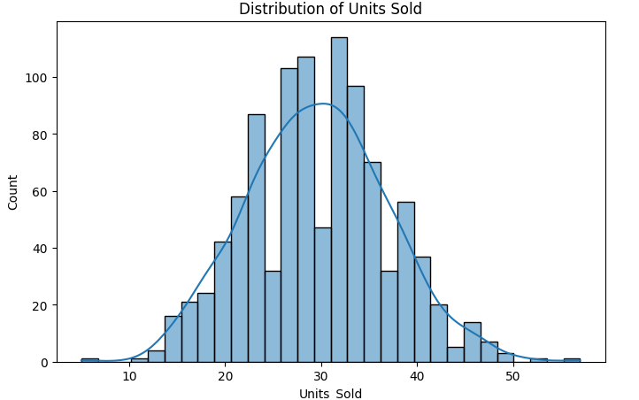
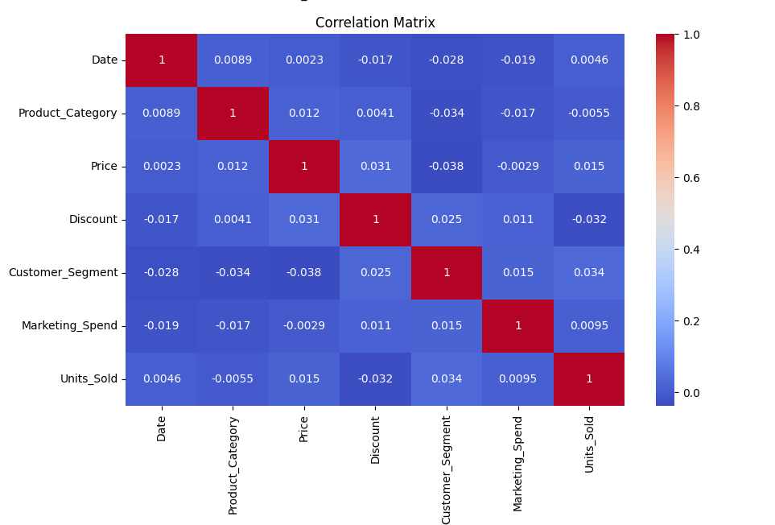

# E-Commerce Sales Prediction

A machine learning project that builds and compares multiple regression models to predict units sold in an e-commerce dataset.

## Overview

This project implements a complete ML pipeline — from exploratory data analysis through feature engineering, model training, and evaluation — across five regression algorithms. The goal is to identify which model best predicts sales volume and which features drive it.

## Models Compared

| Model | Algorithm |
|-------|-----------|
| Linear Regression | Baseline linear approach |
| Decision Tree | Non-linear, rule-based splits |
| Random Forest | Ensemble of 100 decision trees |
| K-Nearest Neighbors | Instance-based (k=5) |
| MLP Neural Network | Two hidden layers (64, 32 units) |

Models are evaluated on **MAE**, **MSE**, **RMSE**, and **R²**.

## Dataset Features

| Feature | Type | Notes |
|---------|------|-------|
| Date | datetime | Month extracted as feature |
| Product_Category | categorical | Label-encoded |
| Price | numeric | Scaled |
| Discount | numeric | Scaled |
| Customer_Segment | categorical | Label-encoded |
| Marketing_Spend | numeric | Scaled |
| Units_Sold | numeric | **Target variable** |

## Exploratory Data Analysis

### Target Distribution
The target variable (`Units_Sold`) follows an approximately normal distribution centered around 30 units:



### Correlation Matrix
Feature correlations evaluated prior to model training show minimal linear collinearity among predictor variables:



## Project Structure

```
ecommerce-sales-prediction/
├── assets/
│   ├── correlation_matrix.png
│   └── units_sold_distribution.png
├── EcommerceSalesPrediction_Clean.ipynb   # Main notebook
└── Ecommerce_Sales_Prediction_Dataset.csv # Dataset
```

## Notebook Sections

1. Import Libraries
2. Load Dataset
3. Exploratory Data Analysis (EDA)
4. Feature Engineering
5. Preprocessing — Encoding & Scaling
6. Correlation Analysis
7. Model Training & Comparison
8. Results Visualization
9. Feature Importance (Random Forest)
10. Summary

## Setup

**Requirements:** Python 3, Jupyter Notebook

Install dependencies:
```bash
pip install pandas numpy matplotlib seaborn scikit-learn jupyter
```

Run the notebook:
```bash
jupyter notebook EcommerceSalesPrediction_Clean.ipynb
```

> **Note:** Update the dataset file path in the notebook if running in a different environment.

## Key Findings

- Feature importances identified non-linear interactions across marketing investment and pricing tiers as the primary drivers of sales volume.
- **Data Integrity:** `Revenue` was omitted from predictor features during modeling to avoid target leakage (`Revenue = Price × Units_Sold`).
- Encoders and scalers were fit strictly on training splits to prevent lookahead bias (80/20 train/test split with `random_state=42` for reproducibility).

## Author

**Angel Vazquez Maldonado** — [github.com/Avazquez0913](https://github.com/Avazquez0913)
